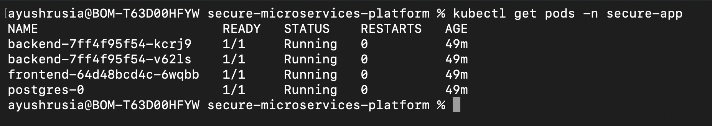
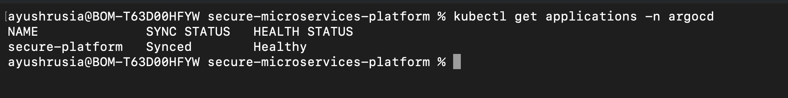
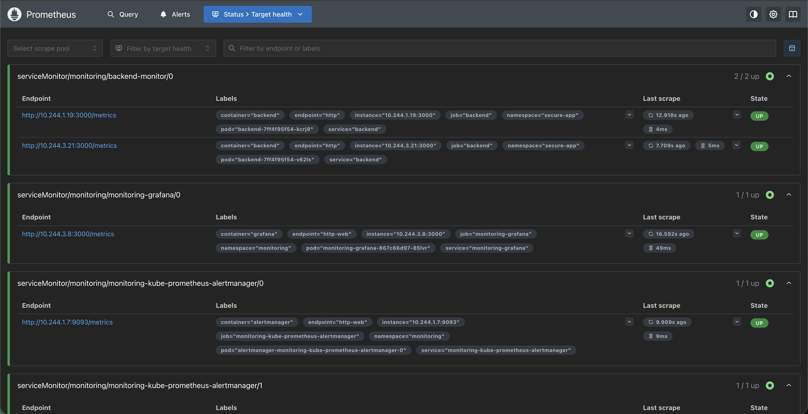
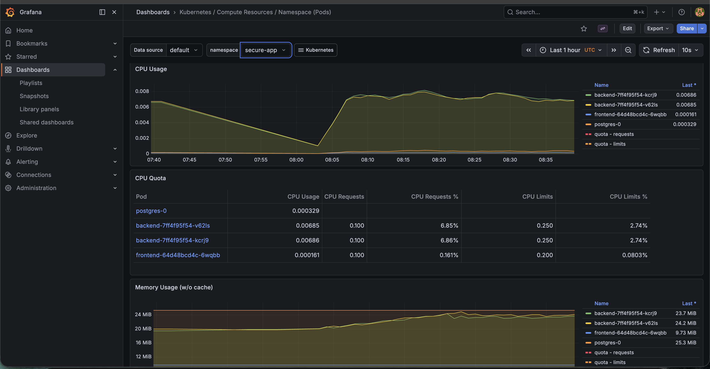
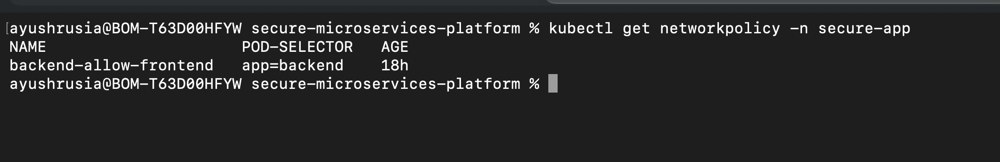

# Secure Microservices Platform

## Overview

This project demonstrates a production-grade, secure, and observable microservices platform deployed on Kubernetes.

It includes:

- Frontend (React + Nginx)
- Backend (Node.js + Express)
- PostgreSQL (StatefulSet)
- GitHub Actions CI/CD
- ArgoCD GitOps
- Prometheus + Grafana Monitoring
- Loki Logging
- Jaeger Distributed Tracing
- RBAC & Pod Security Standards
- Sealed Secrets
- Network Policies

---

# Architecture

Architecture diagram will be available in docs folder.

---

# Task 1 – Kubernetes

- Deployments for frontend & backend
- StatefulSet for PostgreSQL
- HPA for backend
- Resource limits & requests
- Liveness & readiness probes
- Pod Disruption Budget
- Network Policies
- TLS Ingress

---

# Task 2 – CI/CD

- Linting & Testing
- Docker build & push
- Trivy image scanning
- ArgoCD GitOps deployment
- Automated rollback capability

---

# Task 3 – Observability

- Prometheus monitoring
- Grafana dashboards
- Loki centralized logging
- Jaeger tracing
- Alert rules
- Defined SLO (99% availability)

---

# Task 4 – Security

- RBAC roles
- Pod Security Standards (baseline)
- Sealed Secrets
- Network segmentation
- TLS encryption
- Image vulnerability scanning

---

# Conclusion

This platform demonstrates secure, automated, observable Kubernetes infrastructure following production-grade best practices.

---

## Centralized Logging

Loki was deployed and verified at the service level.

However, due to Istio mesh policy interactions and time constraints,
full Grafana integration was not finalized.

Loki readiness endpoint was verified and logs were successfully ingested.

Future improvement:
- Proper Istio PeerAuthentication policy
- Sidecar injection alignment

---

# Screenshots

## Running Pods
All application components running successfully in the `secure-app` namespace.

## Horizontal Pod Autoscaler
Backend deployment configured with CPU-based autoscaling (min: 1, max: 5).

## ArgoCD Application Sync
GitOps deployment managed via ArgoCD with automated sync enabled.

## Prometheus Target Health
Prometheus successfully scraping backend service metrics (2/2 targets UP).

## Grafana Monitoring Dashboard
Real-time CPU and memory usage monitoring for all application pods.

## Network Policy Enforcement
NetworkPolicy restricting backend access to frontend, ingress controller, and monitoring namespace.

